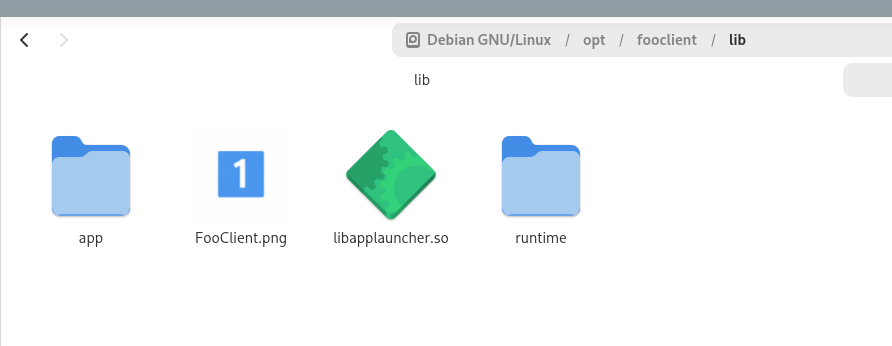

# Java Minimum Desktop App

To demonstrate how easy is to build a desktop application with Java.

Demonstrates JDK24 and JDK25 for creating a `.deb` package.

## Issue

This app has two icons:

- [res/FooClient.png](./res/FooClient.png) - png with one as number
- [res/two.png](./res/two.png) - png with two as number

`deb` should use `two.png`, but uses 1:



## Hints

For a smooth building experience, it is recommended that you follow these rules on where and how to check out the source code.

* Do not check out the source code in a path which contains spaces or special characters. Chances are the build will not work. This is most likely to be an issue on Windows systems.
* Do not check out the source code in a path which has a very long name or is nested many levels deep. Chances are you will hit an OS limitation during the build.

## How to build

You can quickly try out with [`gg.cmd`](https://github.com/eirikb/gg):

```bash
./gg.cmd run:java@25 bash ./build.sh
```

Replace `25` with the JDK version you want to try.

For manual steps, see `build.sh`.

`jpacakge` will create the installer `deb` for this self-contained application. It consists of a single, installable bundle that contains the application and a copy of the JRE needed to run the application. When the application is installed, it behaves the in the same way as any native application.

## More to read

* [jpackage](https://docs.oracle.com/en/java/javase/25/docs/specs/man/jpackage.html)
* [override jpackage resources](https://docs.oracle.com/en/java/javase/25/jpackage/override-jpackage-resources.html)
* [`template.desktop`](https://github.com/openjdk/jdk/blob/a35945ae067ffd60d5f374060086650636ebd9de/src/jdk.jpackage/linux/classes/jdk/jpackage/internal/resources/template.desktop)
* <https://docs.oracle.com/javase/tutorial/deployment/selfContainedApps/index.html>
* <https://docs.oracle.com/javase/10/tools/javapackager.htm#JSWOR719>
* <https://andrastornai.com/>
* [JabRef#15180](https://github.com/JabRef/jabref/issues/15180) - missing icon at JabRef
